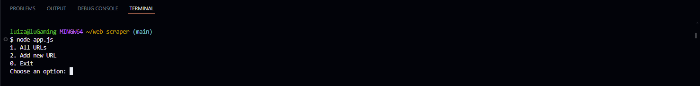
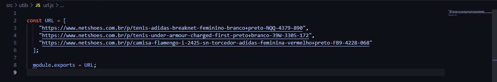
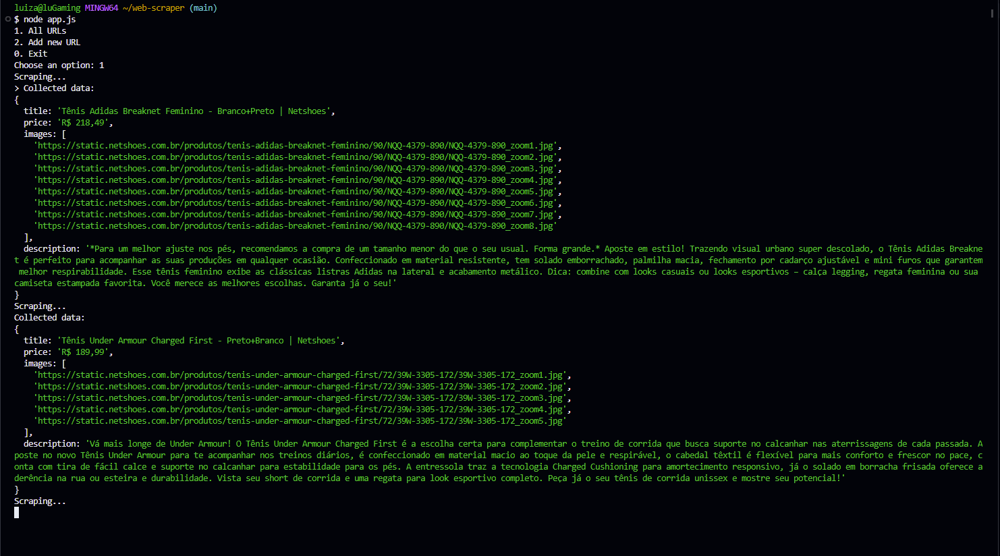
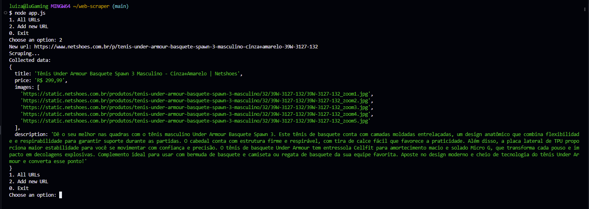
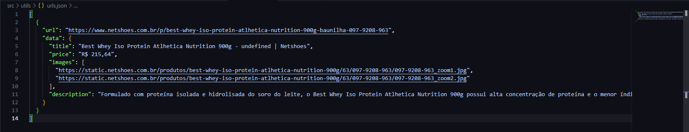

# Web Scraper com Node.js e Puppeteer

Este é um projeto simples de web scraper desenvolvido em Node.js utilizando a biblioteca Puppeteer para extrair dados de páginas da web. O scraper é capaz de coletar informações como título, preço, imagens e descrição de produtos de URLs fornecidas pelo usuário ou das urls disponibilizadas pelo projeto.

## Funcionalidades

- **Processamento de URLs:** Permite ao usuário processar informações de várias URLs de uma vez, inclusas no projeto.
- **Adição de Nova URL:** Permite ao usuário adicionar novas URLs para serem processadas.
- **Coleta de Dados:** Utiliza Puppeteer para navegar até as páginas, extrair informações relevantes e exibir no console.
- **Registro das urls processadas:** Utiliza o fs para criar um arquivo contendo o Json das urls que já foram processadas.
## Pré-requisitos

- Node.js instalado na sua máquina.
- Gerenciador de pacotes npm ou yarn.

## Instalação

1. Clone o repositório para sua máquina local:

   ```
   git clone https://github.com/aziulll/web-scraper-with-node.git
   ```

2. Instale as dependências do projeto:

   ```
   cd web-scraper-with-node
   npm install
   ```

## Utilização

1. Execute o programa através do seguinte comando:

   ```
   node app.js
   ```

2. O programa exibirá um menu com opções para processar URLs existentes, adicionar novas URLs ou encerrar o programa.

3. Para processar todas as URLs existentes, escolha a opção correspondente no menu e os dados serão coletados e exibidos no console.

4. Para adicionar uma nova URL, selecione a opção correspondente, insira a URL quando solicitado e os dados serão coletados e adicionados à lista de URLs processadas.

5. Para encerrar o programa, selecione a opção correspondente no menu.


## Outputs de exemplo



```
As urls que irão ter o conteúdo extraido na opção 1
```




```
Opção 2
```


```
Histórico de Urls que foram extraidas; Arquivo é criado ao rodar o projeto
```


## Estrutura do Projeto

- **`Scraper.js`**: Contém a classe `Scraper` responsável por realizar o scraping de uma página utilizando Puppeteer.
- **`app.js`**: Arquivo principal que gerencia a interação com o usuário e utiliza a classe `Scraper` para coletar os dados.
- **`utils/`**: Pasta contendo módulos auxiliares como salvar URLs e gerenciar as URLs processadas.

## Contribuição

Contribuições são bem-vindas! Sinta-se à vontade para enviar pull requests ou abrir issues para sugestões, melhorias ou correções de bugs.

## Licença

Este projeto está licenciado sob a [MIT License](https://opensource.org/licenses/MIT).

---

Adapte o conteúdo conforme necessário para refletir melhor o seu projeto específico. Incluir detalhes adicionais sobre o funcionamento interno do scraper, como a manipulação de dados ou tratamento de erros, também pode ser útil dependendo da complexidade do seu aplicativo.
